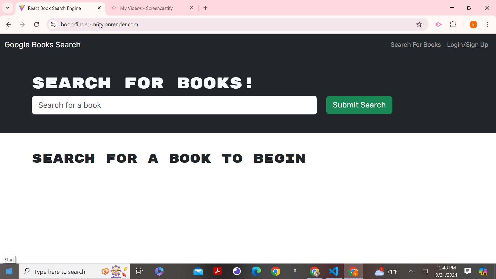
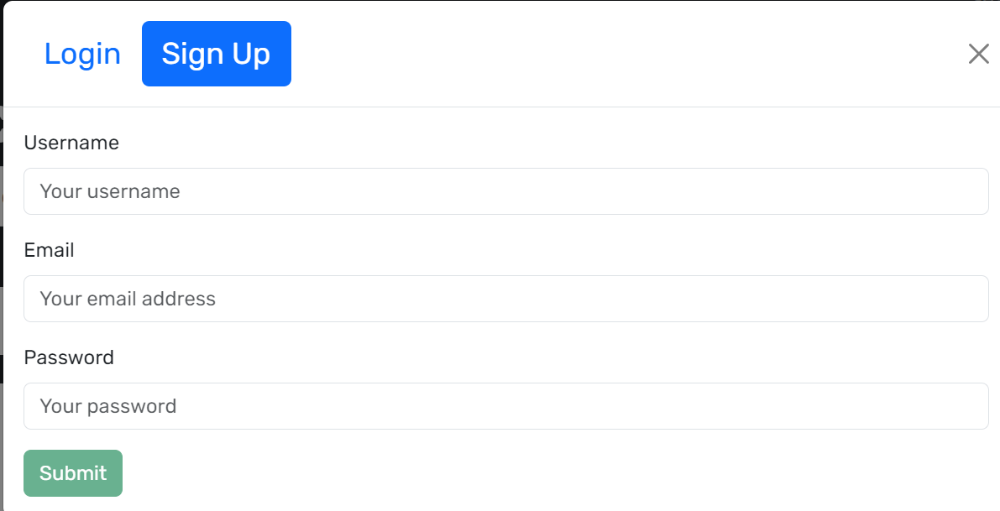
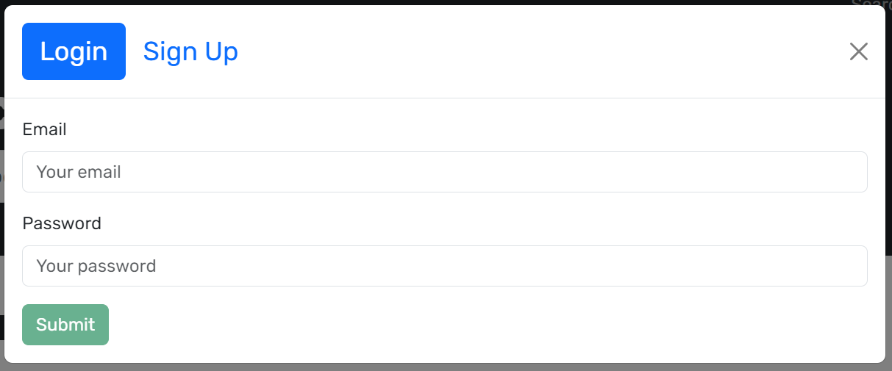
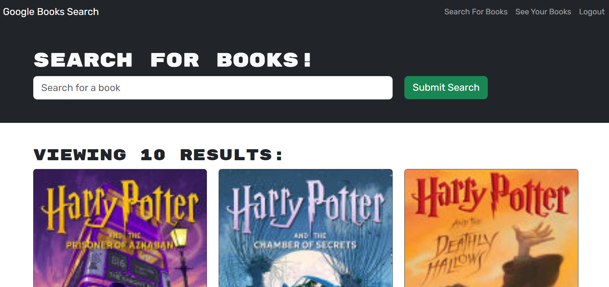
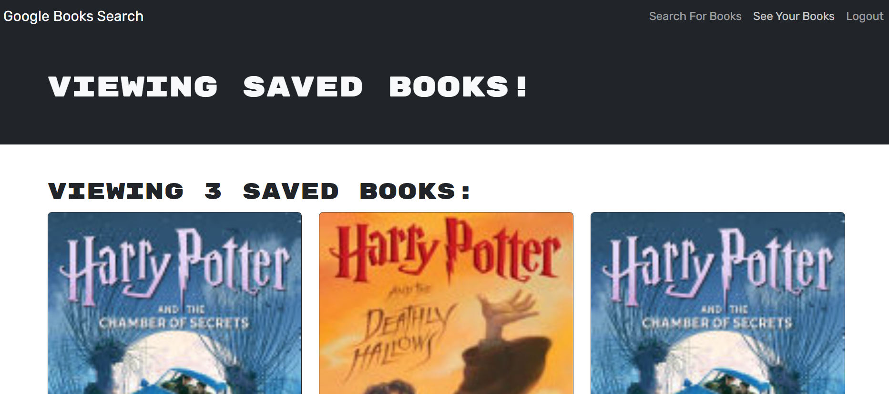

# Book Search Engine

The Book search engine is an application is leveraging the entire MERN stack and with a React front end, MongoDB database, and Node.js/Express.js server and API. It's set up to allow users to save book searches to the back end. The application is built using Google Books API search engine build with GraphQL API and Apollo Server.

## Description

This is a full MERN stack application that uses graphql to allow a user to search for, and save favorite books from the google books API.This application also allows save books to your saved book list and remove books from the saved book list. This application uses React.js along with MongoDB on the back end and graphQL. It allows a user to signup/sign in, search for any book using a third party book api, and add or remove those books to a personal list of favorites. It implements JWT as the authentication, and localstorage to reduce db loads. The entire app runs off of Apollo server/client.

The URL of the GitHub repository is https://github.com/aniraannu/book-search-engine and the repository name is book-search-engine

🚀The application has been deployed to Render and the URL of the deployed application is:- https://book-finder-m6ty.onrender.com

The following animation demonstrates the application functionality:
.

The following image shows the application's homepage:

The following image shows the application's signup page:

The following image shows the application's login page:

The following image shows the application's search for a particular book:

The following image shows the saved books page:

## Getting Started

Application is deployed using Render and be directly accesed using the render link.

The user can save books by clicking "Save This Book!" under each search result, as shown in the following animation:

A user can view their saved books on a separate page, as shown in the following animation:

### Technologies Employed

Technology:

- MongoDB
- Express.js
- React.js
- Node.js
- JavaScript
- GraphQL API
- Apollo Server

### Installing

- To run the application locally, clone the repo from the following link: https://github.com/aniraannu/book-search-engine
- Run the following line of code in your terminal at the ROOT level to install all the needed packages(make sure you have node.js installed on your machine):
  'npm i'

- Start application: Once all the packages have been installed, CD into the SERVER level of the file structure and run the following code in command line :
  'npm run develop'

- This application runs on http://localhost:3000/ open url to begin using Book Search app. A new user should create a login by signing up, then search, save and remove books from the profile as needed.

### Executing program

- The application code can be cloned from the following Github link:
  [GitHub-book-search-engine](https://github.com/aniraannu/book-search-engine)

- The application is deployed using Render and can be directly accesd from: https://book-finder-m6ty.onrender.com

## Help

NA

## Authors

Contributors names and contact info

Anira Raveendran
[@aniraannu](https://github.com/aniraannu)

## Version History

- 0.1
  - Initial Release

## License

None

## Acknowledgments

Inspiration, code snippets, etc.

- [dbader](https://github.com/dbader/readme-template)
- [starter-code]
- [Deploy with Render and MongoDB Atlas](https://coding-boot-camp.github.io/full-stack/mongodb/deploy-with-render-and-mongodb-atlas)
